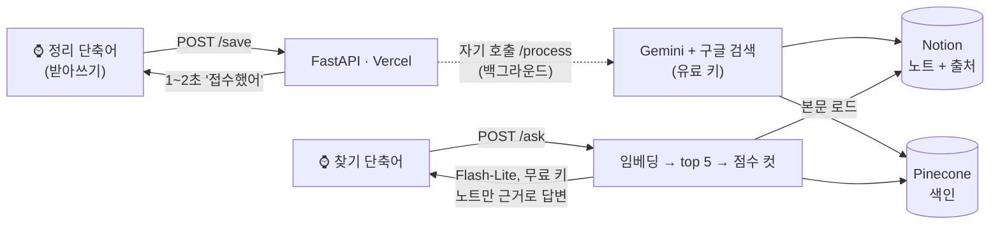
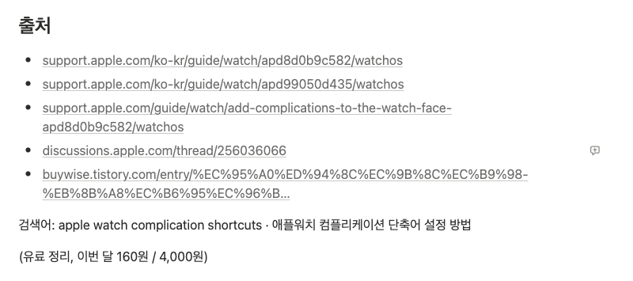

# wrist-rag

[English](README.md) | **한국어**

[](https://github.com/songwookun/wrist-rag/actions/workflows/test.yml)


**애플워치에 말하면 실제로 검색해서 출처가 달린 노트를 노션에 만들고, 나중에 말로 물으면 내 노트에서 찾아 읽어준다.**
앱도 키보드도 없이 손목만으로 매일 쓰는 RAG다.



## 실제로 쓰고 있다

이 프로젝트를 private으로 **실제 유료 키를 걸어서** 배포하고, 워치로 매일 쓰고 있다. 아래 내용은 데모가 아니라 그 환경 그대로다.

- **이틀 동안 노트 12개, 전부 첫 시도에 `완료`.** 출처 기능을 넣은 뒤 만든 노트에는 모두 원문 링크가 달려 있다.
- **이번 달 224원.** 만들면서 한 테스트 비용까지 포함한 금액이고, 월 상한은 4,000원이다.
- 찾기는 무료다. 답변은 Flash-Lite 무료 등급(하루 500회)으로 한다.

**노션 화면** — 워치가 이걸 채운다. 상태 안내, 노트 DB, 맨 아래 사용량 DB(이번 달 224원, 유료 검색 10회)는 모두 `scripts/setup_notion.py`가 만든다.


**노트 하나** — 요약, 키워드, 원래 요청, **원문 출처 링크**(`support.apple.com` 등)


**모든 노트 맨 아래의 근거** — 구글 검색 그라운딩에서 풀어낸 원문 주소, 모델이 실제로 실행한 검색어, 이 노트에 든 비용



## 왜 만들었나

대부분의 "AI 노트"는 모델의 기억으로 쓰여서, 나중에 지어낸 내용인지 구분할 수 없다.
여기서는 **구글 검색을 해야만 노트가 써지고**, 노트에 그 근거가 남는다.

- **원문 주소**: 구글 그라운딩 링크는 만료될 수 있는 리다이렉트라서, 저장하기 전에 원문 주소로 푼다
- **모델이 실제로 실행한 검색어** (`web_search_queries`)
- 강제 재시도 후에도 검색을 안 했으면 ⚠️ 표시

찾을 때는 **내 노트만 근거로** 답한다. 점수 컷을 넘는 노트가 없으면 LLM을 아예 부르지 않고 "노트에 그 내용은 없어"라고 답한다.

## 만들면서 알게 된 것

| 발견 | 대응 |
|---|---|
| **Gemini 무료 등급은 구글 검색 할당량이 0이다.** 검색을 켜면 바로 429 | 정리는 유료 키로 바로, 찾기는 무료 |
| **결제를 켠 프로젝트**의 키를 무료 키로 쓰면 429가 안 나서 전부 조용히 과금된다 (실제로 겪음) | 무료 키와 유료 키는 다른 프로젝트에서 발급 (AI Studio 결제 등급 칸으로 확인) |
| 무료 등급 Flash는 **하루 20회**라 찾기가 금방 바닥남 | 찾기 답변은 Flash-Lite(하루 500회). 환경변수로 교체 가능 |
| 검색 도구를 켜도 모델이 **검색을 건너뛰는** 경우가 있다 | "반드시 검색" 지시로 한 번 재생성, 그래도 안 하면 ⚠️ |
| `gemini-3.8-flash`가 503 "high demand"를 종종 냄 | 1초 뒤 재시도, 찾기는 다른 모델로 한 번 더 |
| 429가 "일일 한도 소진"일 수도, "분당 몰림"일 수도 있다 | `quotaId`를 읽어서 `PerDay`일 때만 유료 전환, 분당 제한은 기다렸다 무료로 재시도 |
| 컷 0.65는 주제가 비슷하면 뚫린다 ("등산화" 질문 → "러닝화" 노트 0.667) | 찾기마다 top 5 점수를 로그에 남겨 `SCORE_THRESHOLD` 조정 근거로 |

## 측정값 (2026-10)

| | |
|---|---|
| `/save` 응답 | 1.1~1.5초 (콜드 스타트 3.7초) |
| 노션에 노트 완성 | 약 20~30초 |
| `/ask` 답변 | 3~5초, 노트에 없으면 0.5초 (LLM 미호출) |
| 정리 1회 비용 | 약 37~43원 (부가세 포함, 검색어 0~6개) |
| 찾기 | 무료 — Flash-Lite 하루 500회, 분당 15회 |

## 비용과 한도

| | 키 | 비용 |
|---|---|---|
| 정리 (검색 + 노트) | 유료 키 직행 | 1회 약 40원 |
| 찾기·임베딩 | 무료 키 먼저 | 0원. **무료 일일 한도를 정말 다 썼을 때만** 유료 |
| 월 상한 | 정리 + 찾기 합산 (`BUDGET_KRW`) | 다음 정리가 넘칠 것 같으면 접수 단계에서 막음 |

## 시작하기

필요한 것: 아이폰과 애플워치, 그리고 Google AI Studio, Notion, Pinecone, Vercel 무료 계정.

```bash
git clone https://github.com/songwookun/wrist-rag && cd wrist-rag
python3 -m venv .venv && .venv/bin/pip install -r requirements.txt pytest
cp .env.example .env
```

**1. Gemini 키 2개** (https://aistudio.google.com/apikey)
- `GEMINI_FREE_KEY`: 결제를 **켜지 않은** 프로젝트의 키. 결제 등급 칸이 "무료 등급"이어야 한다.
- `GEMINI_PAID_KEY`: **별도 프로젝트**를 만들고 결제를 설정한 뒤 발급한다.
- `PRICE_IN_USD_PER_M`, `PRICE_OUT_USD_PER_M`: 요금표(https://ai.google.dev/gemini-api/docs/pricing)에서 확인해서 넣는다.
- 선택: Google Cloud 결제에서 유료 프로젝트에 예산 알림을 걸어둔다.

**2. Notion**
1. https://www.notion.so/profile/integrations → 새 연결(내부). 권한은 콘텐츠 읽기·업데이트·삽입만 켠다. 토큰을 `NOTION_TOKEN`에 넣는다.
2. 빈 페이지를 만들고 `···` → 연결 → 방금 만든 연결을 추가한다.
3. `.venv/bin/python scripts/setup_notion.py`를 실행하면 DB 두 개가 생기고 ID가 `.env`에 들어간다.

**3. Pinecone** — https://app.pinecone.io → API Keys → `PINECONE_API_KEY`
```bash
.venv/bin/python scripts/setup_pinecone.py     # 768차원 cosine 인덱스
```

**4. 비밀값**
```bash
python3 -c "import secrets;print(secrets.token_urlsafe(24))"     # → WRIST_SECRET
```

**5. 테스트하고 배포**
```bash
.venv/bin/pytest
npm i -g vercel && vercel login && vercel link
grep -E '^[A-Z_]+=.+' .env | while IFS='=' read -r k v; do printf '%s' "$v" | vercel env add "$k" production --force; done
vercel deploy --prod
```
운영 주소를 **`SELF_URL`**에 넣고 한 번 더 배포한다. 배포마다 생기는 개별 주소는 Vercel 로그인 보호가 걸려 있어서 백그라운드 자기 호출이 막힌다. `curl https://<주소>/`가 `{"ok":true}`면 성공이다.

## 아이폰 단축어 → 애플워치

**정리** (단축어 앱 → +):
1. **텍스트 받아쓰기**: 언어 한국어, 듣기 중지는 "일시 정지 후"
2. **URL 콘텐츠 가져오기**: URL에는 `https://<주소>/save`를 직접 입력한다. 받아쓰기 변수가 자동으로 들어가면 지운다.
   - 메소드: **POST**
   - 헤더: `X-Secret` = `WRIST_SECRET` 값
   - 본문: **JSON**, `text` = **받아쓴 텍스트**
3. **사전 값 가져오기**: 키 `message`
4. **콘텐츠 보기** (예전 iOS는 "결과 보기")

**찾기**: 정리를 복제하고 URL을 `/ask`로 바꾼 뒤, 콘텐츠 보기 앞에 **텍스트 말하기**를 넣는다.

두 단축어 모두 **Apple Watch에서 보기**를 켠다. 워치 페이스는 iPhone Watch 앱 → 페이스 갤러리 → **모듈** → 컴플리케이션에서 가운데 큰 칸은 단축어 → 정리, 왼쪽 아래는 단축어 → 찾기로 둔다. 페이스를 한 번 탭하면 바로 받아쓰기가 시작된다.

> 단축어를 iCloud 링크로 공유하면 `X-Secret`과 주소도 같이 나간다. 공유용은 그 두 칸을 **가져오기 질문**으로 바꾼 사본을 따로 만들어야 한다.

## 내 말투로 바꾸기

사용자에게 보이는 글자는 전부 **`wrist_notes/locales/<LANGUAGE>.json`**에 있다. 워치 응답, 노션 속성 이름과 상태값, 노트 작성과 답변 프롬프트가 다 여기 있다. GitHub 웹에서 고치면 Vercel이 다시 배포한다.

- `{중괄호}` 자리는 지워도 되지만 새로 만들면 안 된다. 서버가 시작할 때 검사해서 틀린 키를 알려준다.
- `notion` 이름을 바꾸면 노션 DB 속성 이름도 똑같이 바꿔야 한다.
- 새 언어는 `xx.json`을 추가하고 `LANGUAGE=xx`로 쓴다. 언어는 `setup_notion.py`를 돌리기 **전에** 정한다.

## 환경변수

| 이름 | 필수 | 기본값 | 설명 |
|---|---|---|---|
| `WRIST_SECRET` | ✅ | | 단축어 `X-Secret` 헤더 |
| `GEMINI_FREE_KEY` / `GEMINI_PAID_KEY` | ✅ | | **서로 다른** 프로젝트의 키 |
| `PRICE_IN_USD_PER_M` / `PRICE_OUT_USD_PER_M` | ✅ | | 100만 토큰당 USD (thinking은 출력 단가) |
| `NOTION_TOKEN`, `NOTION_NOTES_DB_ID`, `NOTION_USAGE_DB_ID` | ✅ | | DB ID는 `setup_notion.py`가 채운다 |
| `PINECONE_API_KEY` | ✅ | | |
| `LANGUAGE` / `TIMEZONE` | | `ko` / `Asia/Seoul` | |
| `GEMINI_MODEL` | | `gemini-flash-latest` | 정리 모델 (별칭이라 모델 은퇴에 강함) |
| `GEMINI_ANSWER_MODEL` | | `gemini-flash-lite-latest` | 찾기 답변 모델 |
| `EMBEDDING_MODEL` / `EMBEDDING_DIM` | | `gemini-embedding-001` / `768` | 바꾸면 새 인덱스 + `/reindex` |
| `PINECONE_INDEX` | | `wrist-rag` | |
| `SCORE_THRESHOLD` | | `0.65` | 로그 점수를 보고 조정 |
| `BUDGET_KRW` / `NOTE_COST_ESTIMATE_KRW` / `USD_KRW` | | `4000` / `50` / `1540` | 부가세 포함 환율 |
| `PRICE_SEARCH_USD` | | `0` | 검색 1회 단가 (월 무료 제공량 안이면 0) |
| `SAVE_MODE` | | `async` | `sync`는 노트 완성까지 기다림 (시리 시간 제한에 걸리기 쉬움) |
| `SELF_URL` | | 요청 주소 | 운영 주소 |

## 문제가 생기면

| 증상 | 확인할 곳 |
|---|---|
| 노트가 계속 진행중 | Vercel Logs `[process]`, `SELF_URL` |
| 모든 경로 404 | `vercel.json`에 rewrites가 없어야 함 |
| 빌드 실패 "No `project` table" | 루트에 `pyproject.toml`을 두지 말 것 (pytest 설정은 `pytest.ini`) |
| 노션 404 / 400 | DB에 연결 추가 여부 / 속성 이름이 언어 파일과 같은지 |
| 노트마다 ⚠️ 출처 없음 | 유료 키, 로그의 `검색어=[]` |
| 엉뚱한 노트로 답함 | 로그의 top 5 점수 → `SCORE_THRESHOLD` |
| 색인 다시 만들기 | `curl -XPOST https://<주소>/reindex -H "X-Secret: …" -H 'Content-Type: application/json' -d '{}'`를 `next_cursor`가 null이 될 때까지 반복 |

## 구조

```
api/index.py            Vercel 진입점 (FastAPI 앱 노출)
wrist_notes/
  main.py               라우트 /save /process /ask /reindex, 인증, 항상 200 응답
  jobs.py               접수 → 백그라운드 처리 → 재시도·멈춘 작업 정리
  budget.py             무료/유료 키 선택, 429 분류, 월 상한
  gemini.py             검색 노트 생성, 출처 원문 풀기, 임베딩, 답변
  retrieval.py          찾기: 임베딩 → top 5 → 컷 → 본문 로드 → 답변
  notion.py             노션 API (데이터 소스, 블록, 사용량 DB)
  vectors.py            Pinecone
  i18n.py, locales/     사용자에게 보이는 모든 글자, 기동 시 검증
scripts/                setup_notion.py, setup_pinecone.py
tests/                  외부 API는 전부 가짜, 키 불필요
```

## 라이선스

MIT
