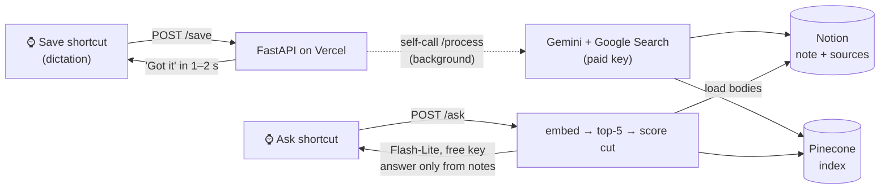
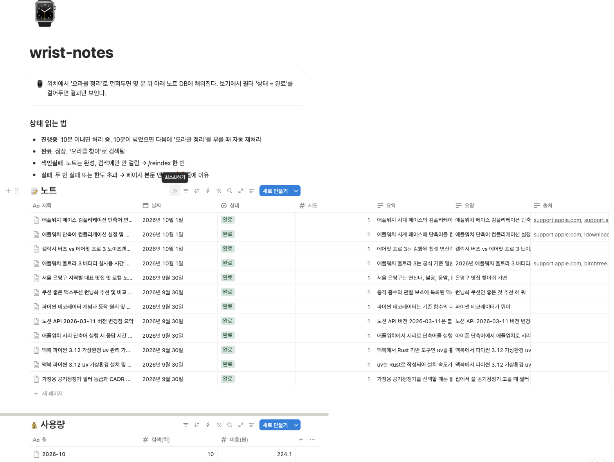
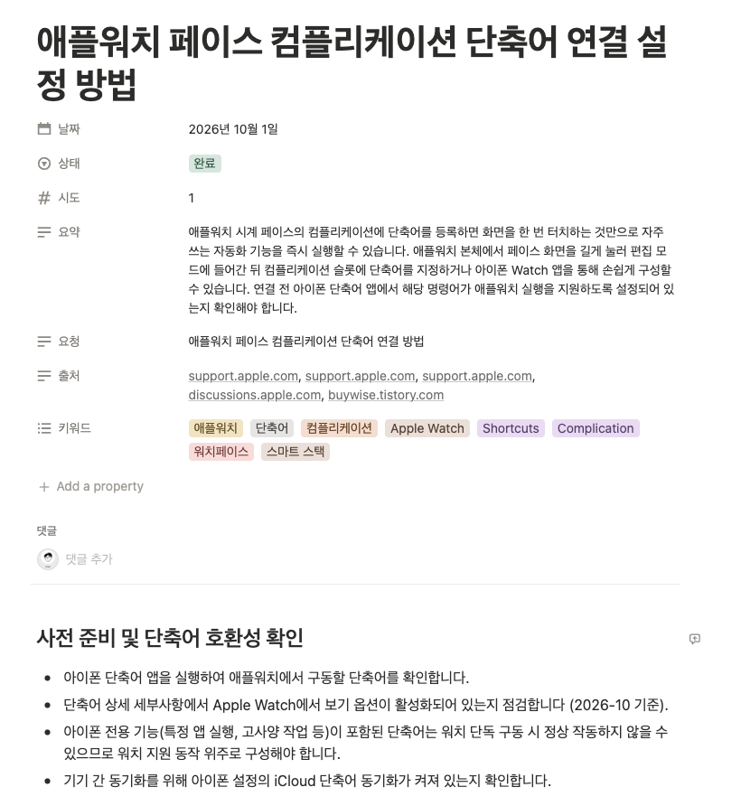

# wrist-rag

**English** | [한국어](README.ko.md)

[](https://github.com/songwookun/wrist-rag/actions/workflows/test.yml)


**Talk to your Apple Watch, get a research note with real web sources in Notion — then ask your own notes back by voice.**
A RAG you actually use every day: no app, no keyboard, just your wrist.



## In daily use

I run this privately with **a real paid key** and use it from my watch every day. Everything below is from that setup, not a demo.

- **12 notes in two days, all `Done` on the first attempt.** Every note made after the sources feature shipped has linked original URLs.
- **₩224 this month (~$0.15)**, which includes all the testing while building it. The monthly cap is ₩4,000.
- Asking is free: answers use the Flash-Lite free tier (500/day).

**Notion workspace** — the watch fills this in. The status guide and both databases are created by `scripts/setup_notion.py`.



**A note** — summary, keywords, and **linked sources** (`support.apple.com`, …) resolved from Google Search grounding



**Usage database** — paid cost and search count per month. The budget guard reads this before every paid call.


## Why

Most "AI notes" are written from the model's memory, and you can't tell later whether something was made up.
Here, **a note only gets written with Google Search**, and the note keeps the evidence:

- the **original URLs** (Google's grounding redirect links are resolved before saving, because they can expire)
- the **search queries the model actually ran** (`web_search_queries`)
- a ⚠️ mark if the model still answered without searching, after one forced retry

And when you ask, it answers **only from your notes**. If nothing scores above the cutoff, the LLM isn't even called and it says "That's not in your notes".

## What we learned building it

| Finding | What we did |
|---|---|
| **The Gemini free tier has zero Google Search quota.** Grounded calls get 429 right away | Saving goes straight to the paid key; asking stays free |
| A "free" key from a **billing-enabled project** never returns 429, so everything is billed silently | Free and paid keys must come from different projects (checked in AI Studio's billing-tier column) |
| Free-tier Flash allows **20 requests/day**, and asking ran out of it | Answers use Flash-Lite (500/day). The model is configurable |
| The model sometimes **skips search** even with the tool enabled | One regeneration with a "you must search" instruction, then a ⚠️ mark |
| `gemini-3.8-flash` returns 503 "high demand" at times | 1 s retry, then the answer falls back to the other model |
| A 429 can mean "daily quota used up" or "too many per minute" | Read `quotaId`. Only `PerDay` moves to paid; per-minute limits wait and retry for free |
| A 0.65 cutoff lets topic neighbors through ("hiking shoes" → "running shoes" note at 0.667) | Top-5 scores are logged on every ask, so you can tune `SCORE_THRESHOLD` |

## Numbers (measured, 2026-10)

| | |
|---|---|
| `/save` response | 1.1–1.5 s (cold start 3.7 s) |
| Note ready in Notion | ~20–30 s |
| `/ask` answer | 3–5 s; 0.5 s when nothing matches (no LLM call) |
| Cost per note | ~$0.025–0.03 (₩37–43 incl. VAT, 0–6 search queries) |
| Ask | free — Flash-Lite 500/day, 15/min |

## Costs and limits

| | Key | Cost |
|---|---|---|
| Save (search + note) | paid, directly | ~$0.03 each |
| Ask, embeddings | free first | $0; paid **only when the free daily quota is truly used up** |
| Monthly cap | save + ask combined (`BUDGET_KRW`) | blocked at intake if the next note would exceed it |

**Using USD**: `LANGUAGE=en`, `USD_KRW=1` (or `1.1` with tax), `BUDGET_KRW=3` (= $3/month), `NOTE_COST_ESTIMATE_KRW=0.04`.

## Quick start

You need an iPhone + Apple Watch, and free accounts on Google AI Studio, Notion, Pinecone and Vercel. All are available worldwide, but check that the Gemini API is offered in your country: https://ai.google.dev/gemini-api/docs/available-regions

```bash
git clone https://github.com/songwookun/wrist-rag && cd wrist-rag
python3 -m venv .venv && .venv/bin/pip install -r requirements.txt pytest
cp .env.example .env            # set LANGUAGE=en for English
```

**1. Gemini — two keys** (https://aistudio.google.com/apikey)
- `GEMINI_FREE_KEY`: from a project **without** billing. The billing-tier column must say "Free tier".
- `GEMINI_PAID_KEY`: create a **separate** project, set up billing, then create the key.
- Fill `PRICE_IN_USD_PER_M` and `PRICE_OUT_USD_PER_M` from https://ai.google.dev/gemini-api/docs/pricing
- Optional safety net: a budget alert on the paid project in Google Cloud Billing.

**2. Notion**
1. https://www.notion.so/profile/integrations → new internal integration with read, update and insert content only. Put the token in `NOTION_TOKEN`.
2. Create an empty page → `···` → Connections → add the integration.
3. `.venv/bin/python scripts/setup_notion.py` creates both databases in your `LANGUAGE` and writes their IDs to `.env`.

**3. Pinecone** — https://app.pinecone.io → API Keys → `PINECONE_API_KEY`, then
```bash
.venv/bin/python scripts/setup_pinecone.py     # 768-d cosine index
```

**4. Shared secret**
```bash
python3 -c "import secrets;print(secrets.token_urlsafe(24))"     # → WRIST_SECRET
```

**5. Test, then deploy**
```bash
.venv/bin/pytest
npm i -g vercel && vercel login && vercel link
grep -E '^[A-Z_]+=.+' .env | while IFS='=' read -r k v; do printf '%s' "$v" | vercel env add "$k" production --force; done
vercel deploy --prod
```
Set your production URL as **`SELF_URL`** and deploy once more. Per-deployment URLs sit behind Vercel Authentication, which blocks the background self-call. `curl https://<url>/` should return `{"ok":true}`.

## iPhone Shortcuts → Apple Watch

**Save** (Shortcuts app → +):
1. **Dictate Text**: your language, stop listening "After Pause"
2. **Get Contents of URL**: type `https://<url>/save` yourself, and remove the dictation variable if it gets inserted automatically.
   - Method: **POST**
   - Header: `X-Secret` = your `WRIST_SECRET`
   - Request body: **JSON**, `text` = **Dictated Text**
3. **Get Dictionary Value**: key `message`
4. **Show Content** ("Show Result" on older iOS)

**Ask**: duplicate it, change the URL to `/ask`, and add **Speak Text** before Show Content.

Turn on **Show on Apple Watch** for both. Then on the watch face: iPhone Watch app → Face Gallery → **Modular** → Complications → center = Shortcuts → Save, bottom-left = Shortcuts → Ask. One tap and you're dictating.

> Sharing your shortcut via iCloud link shares your `X-Secret` and URL too. Make a separate copy using **Import Questions** for those two fields.

## Make it talk your way

Everything the user sees lives in **`wrist_notes/locales/<LANGUAGE>.json`**: watch replies, Notion property names and statuses, and the note and answer prompts. Edit it on GitHub's web UI and Vercel redeploys.

- You may drop `{placeholders}` but not invent new ones. The server validates the file at startup and names the bad key.
- Renaming a `notion` field means renaming the Notion property too.
- New language: add `xx.json` and set `LANGUAGE=xx`, **before** running `setup_notion.py`.

## Environment variables

| Name | Required | Default | Notes |
|---|---|---|---|
| `WRIST_SECRET` | ✅ | | Shortcut `X-Secret` header |
| `GEMINI_FREE_KEY` / `GEMINI_PAID_KEY` | ✅ | | from **different** projects |
| `PRICE_IN_USD_PER_M` / `PRICE_OUT_USD_PER_M` | ✅ | | USD per 1M tokens (thinking billed as output) |
| `NOTION_TOKEN`, `NOTION_NOTES_DB_ID`, `NOTION_USAGE_DB_ID` | ✅ | | DB IDs filled by `setup_notion.py` |
| `PINECONE_API_KEY` | ✅ | | |
| `LANGUAGE` / `TIMEZONE` | | `ko` / `Asia/Seoul` | |
| `GEMINI_MODEL` | | `gemini-flash-latest` | note model (alias survives retirements) |
| `GEMINI_ANSWER_MODEL` | | `gemini-flash-lite-latest` | ask model |
| `EMBEDDING_MODEL` / `EMBEDDING_DIM` | | `gemini-embedding-001` / `768` | changing them requires a new index + `/reindex` |
| `PINECONE_INDEX` | | `wrist-rag` | |
| `SCORE_THRESHOLD` | | `0.65` | tune from logged scores |
| `BUDGET_KRW` / `NOTE_COST_ESTIMATE_KRW` / `USD_KRW` | | `4000` / `50` / `1540` | in your currency (see USD above) |
| `PRICE_SEARCH_USD` | | `0` | per search query (0 inside the free monthly allowance) |
| `SAVE_MODE` | | `async` | `sync` waits for the full note (often hits Siri's timeout) |
| `SELF_URL` | | request URL | your production URL |

## Troubleshooting

| Symptom | Check |
|---|---|
| Note stuck in Processing | Vercel Logs `[process]`, `SELF_URL` |
| Every route returns 404 | `vercel.json` must not contain rewrites |
| Build fails: "No `project` table" | no `pyproject.toml` in the root (pytest config lives in `pytest.ini`) |
| Notion 404 / 400 | integration connected to the DB / property names match the locale file |
| Every note has ⚠️ no sources | the paid key; `검색어=[]` in logs |
| Ask answers from the wrong note | logged top-5 scores → `SCORE_THRESHOLD` |
| Rebuild the index | `curl -XPOST https://<url>/reindex -H "X-Secret: …" -H 'Content-Type: application/json' -d '{}'` until `next_cursor` is null |

## Structure

```
api/index.py            Vercel entry (exposes the FastAPI app)
wrist_notes/
  main.py               routes /save /process /ask /reindex, auth, always-200 replies
  jobs.py               intake → background processing → retry/stale sweep
  budget.py             free/paid key routing, 429 classification, monthly cap
  gemini.py             grounded note generation, source resolution, embeddings, answers
  retrieval.py          ask: embed → top-5 → cutoff → load → answer
  notion.py             Notion API (data sources, blocks, usage DB)
  vectors.py            Pinecone
  i18n.py, locales/     every user-facing string, validated at startup
scripts/                setup_notion.py, setup_pinecone.py
tests/                  external APIs faked, no keys needed
```

## License

MIT
